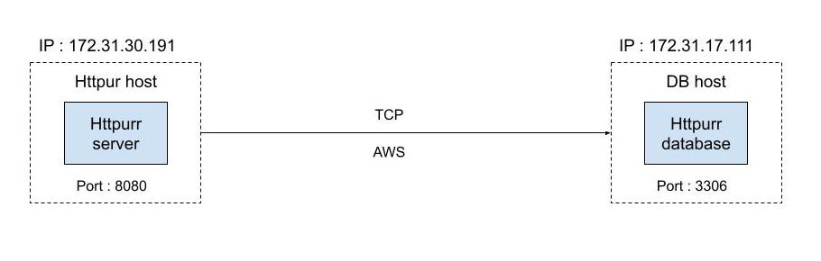

# Troubleshooting Project #3

## Problem definition

When running a request to the server from www host on the default port 80, the connection is aborted with an unexpected network read error. Below is an example of the error encountered when using lynx to make an HTTP request to http://localhost:

```sh
[saadia@ip-172-31-30-191 ~]$ lynx -dump http://localhost/
Looking up localhost
Making HTTP connection to localhost
Alert!: Unable to connect to remote host.
lynx: Can't access startfile http://localhost/

```

**Expected response**

Image of a cat on the terminal.

## Understanding the system

We know from the instructions that :

- The server and the database are hosted in two different host
- We are using postgres as db
- Source code is on the www host : `/httpurr-source/`

## My journey in troubleshooting project #3

### Following the request path

**Checking if the server running correctly**

Running the request with curl in verbose mode :

```sh
[saadia@ip-172-31-30-191 ~]$ curl -v  http://localhost/
* Host localhost:80 was resolved.
* IPv6: ::1
* IPv4: 127.0.0.1
*   Trying [::1]:80...
* connect to ::1 port 80 from ::1 port 50514 failed: Connection refused
*   Trying 127.0.0.1:80...
* connect to 127.0.0.1 port 80 from 127.0.0.1 port 54922 failed: Connection refused
* Failed to connect to localhost port 80 after 0 ms: Couldn't connect to server
* Closing connection
curl: (7) Failed to connect to localhost port 80 after 0 ms: Couldn't connect to server

```

**Hypotheses**

1. The server is not running in the port `:80`:
   I Checked what is running in port 80 using `sudo lsof -i :80 ` and `sudo netstat -tuln | grep :80 ` and got the empty response.
   => Nothing running in port 80
2. The server is running in different port:
   I run the command `sudo netstat -ltup | grep httpurr` and got an empty response.
   => The server is not running at all

**Checking why the server is not running**
At the beginning I tried to check if the server is systemd service and checked the list of running services and couldn't find it. I assumed that it's not, and tried to run the server from the source code -\_-.

- I run the command `cd /httpurr-source/ go run .` and nothing was showing.
- I re-run the command in verbose mode

```sh
[saadia@ip-172-31-30-191 httpurr-source]$ go run -v .
net/http
database/sql/driver
database/sql
encoding/json
filippo.io/edwards25519/field
filippo.io/edwards25519
github.com/go-sql-driver/mysql
github.com/lib/pq/oid
github.com/lib/pq/scram
os/user
regexp/syntax
regexp
github.com/lib/pq
slack-github.com/avandersteldt/httpurr/catsdb
slack-github.com/avandersteldt/httpurr/catsdb: cannot compile Go 1.22 code
```

- We have compatibility problem I checked the `vendor/module.txt` file for any compatibility restrictions.

```sh
[saadia@ip-172-31-30-191 vendor]$ cat modules.txt
# filippo.io/edwards25519 v1.1.0
## explicit; go 1.20
filippo.io/edwards25519
filippo.io/edwards25519/field
# github.com/go-sql-driver/mysql v1.8.1
## explicit; go 1.18
github.com/go-sql-driver/mysql
# github.com/lib/pq v1.10.9
## explicit; go 1.13
github.com/lib/pq
github.com/lib/pq/oid
github.com/lib/pq/scram
```

- I choose to change the go version to 1.13 as it's the restrictive version.

```sh
[saadia@ip-172-31-30-191 httpurr-source]$ go run -v .
get "filippo.io/edwards25519": found meta tag vcs.metaImport{Prefix:"filippo.io/edwards25519", VCS:"git", RepoRoot:"https://github.com/FiloSottile/edwards25519"} at //filippo.io/edwards25519?go-get=1
go: downloading github.com/go-sql-driver/mysql v1.8.1
go: downloading github.com/lib/pq v1.10.9
go: downloading filippo.io/edwards25519 v1.1.0
filippo.io/edwards25519/field
filippo.io/edwards25519
github.com/go-sql-driver/mysql
github.com/lib/pq/oid
github.com/lib/pq/scram
github.com/lib/pq
slack-github.com/avandersteldt/httpurr/catsdb
slack-github.com/avandersteldt/httpurr
2024/05/23 15:40:24 HTTPurr starting...
2024/05/23 15:40:24 listen tcp :80: bind: permission denied
exit status 1
```

- At this point, I remembered that I can check the existence of `httpuur` service using `journactl | grep httpurr` :)
- I checked the server status :

```sh
[saadia@ip-172-31-30-191 httpurr-source]$ systemctl status httpurr.service
○ httpurr.service - HTTPurr
     Loaded: loaded (/etc/systemd/system/httpurr.service; disabled; preset: disabled)
     Active: inactive (dead)
```

- The server is dead. I tried to reactivate it using `sudo systemctl restart httpurr.service`

```sh
[saadia@ip-172-31-30-191 httpurr-source]$ systemctl status httpurr.service
× httpurr.service - HTTPurr
     Loaded: loaded (/etc/systemd/system/httpurr.service; disabled; preset: disabled)
     Active: failed (Result: exit-code) since Thu 2024-05-23 18:18:55 UTC; 4s ago
   Duration: 1ms
    Process: 68962 ExecStart=/usr/local/bin/httpurr --dbengine=postgres --dbhost=ip-192-168-47-214.ec2.internal --dbport=3306 --dbuser=httpurr --dbpass=miauw --dbname=httpurr (code=exited, >
   Main PID: 68962 (code=exited, status=1/FAILURE)
        CPU: 2ms
May 23 18:18:55 ip-172-31-30-191.ec2.internal systemd[1]: Started httpurr.service - HTTPurr.
May 23 18:18:55 ip-172-31-30-191.ec2.internal systemd[1]: httpurr.service: Main process exited, code=exited, status=1/FAILURE
May 23 18:18:55 ip-172-31-30-191.ec2.internal httpurr[68962]: 2024/05/23 18:18:55 HTTPurr starting...
May 23 18:18:55 ip-172-31-30-191.ec2.internal httpurr[68962]: 2024/05/23 18:18:55 listen tcp :80: bind: permission denied
May 23 18:18:55 ip-172-31-30-191.ec2.internal systemd[1]: httpurr.service: Failed with result 'exit-code'.
May 23 18:18:55 ip-172-31-30-191.ec2.internal systemd[1]: httpurr.service: Scheduled restart job, restart counter is at 5.
May 23 18:18:55 ip-172-31-30-191.ec2.internal systemd[1]: Stopped httpurr.service - HTTPurr.
May 23 18:18:55 ip-172-31-30-191.ec2.internal systemd[1]: httpurr.service: Start request repeated too quickly.
May 23 18:18:55 ip-172-31-30-191.ec2.internal systemd[1]: httpurr.service: Failed with result 'exit-code'.
May 23 18:18:55 ip-172-31-30-191.ec2.internal systemd[1]: Failed to start httpurr.service - HTTPurr.
```

- I looked up for more details about the server service :

```sh
[saadia@ip-172-31-30-191 httpurr-source]$ cat /etc/systemd/system/httpurr.service
[Unit]
Description=HTTPurr
[Service]
User=httpurr
Group=httpurr
TimeoutStartSec=0
Restart=always
ExecStart=/usr/local/bin/httpurr --dbengine=postgres --dbhost=ip-192-168-47-214.ec2.internal --dbport=3306 --dbuser=httpurr --dbpass=miauw --dbname=httpurr
[Install]
WantedBy=multi-user.target
```

- From the error message and what we have in the service file. The httpurr user don’t have access to run the server (permission denied)

**Hypotheses**

1. Maybe the user `httpurr`or the group `httpurr` don’t exist

```sh
[saadia@ip-172-31-30-191 httpurr-source]$ cat /etc/passwd
root:x:0:0:root:/root:/bin/bash
bin:x:1:1:bin:/bin:/sbin/nologin
…
httpurr:x:1001:1001::/home/httpurr:/bin/bash
…
```

=> The `httpurr` user exist

```sh
[saadia@ip-172-31-30-191 httpurr-source]$ cat /etc/group
root:x:0:
bin:x:1:
…
httpurr:x:1001:
…
```

=> The `httpurr`group exist

2.  Maybe the user `httpurr` doesn't have the right permission

- At the beginning I was think it’s a permission related to the file accessed by the `httpurr `user during the start of the server and checked the permission for `/usr/local/bin/httpurr` and the source code

```sh
[saadia@ip-172-31-30-191 httpurr-source]$ ls -l
total 12
drwxrwxr-x. 2 root root  22 May 10 09:16 catsdb
-rw-rw-r--. 1 root root 186 May 23 15:40 go.mod
-rw-rw-r--. 1 root root 499 May 10 09:16 go.sum
-rw-rw-r--. 1 root root 966 May 10 09:16 httpurr.go
drwxrwxr-x. 4 root root  61 May 23 15:39 vendor
```

=> The user `httpurr` have the right to read those files which is enough

```sh
[saadia@ip-172-31-30-191 httpurr-source]$ ls -l /usr/local/bin/httpurr
-rwxr-xr-x. 1 root root 8508029 May 10 09:12 /usr/local/bin/httpurr
```

=> The user `httpurr` have the right to read and execute this file which is enough

- I searched for the error listen tcp :80: bind: permission denied
  And then found that 80 is a privileged port :

_In Linux, a privileged port is a port in the range 1-1023. By default, privileged ports can’t be bound to non-root processes._

=> So `httpurr` is a non-root user so this user can’t bind to 80

- The easiest solution that comes to my mind is to bind to a different port
- I changed the port on the `httpurr.go` file and reloaded the daemon and restarted the service but it kept failing.
- I found that `ExecStart=/usr/local/bin/httpurr` is an executable file of my go app. So I needed to rebuild my executable to be able to get the changes that I made.
  I rebuilt the server executable file.

```sh
[saadia@ip-172-31-30-191 httpurr-source]$ sudo go build -o /usr/local/bin/httpurr /httpurr-source/httpurr.go
```

- I reloaded the daemon and restarted the service and the server started.

```sh
[saadia@ip-172-31-30-191 httpurr-source]$ sudo systemctl status httpurr.service
● httpurr.service - HTTPurr
     Loaded: loaded (/etc/systemd/system/httpurr.service; disabled; preset: disabled)
     Active: active (running) since Thu 2024-05-23 19:21:54 UTC; 2s ago
   Main PID: 72281 (httpurr)
      Tasks: 4 (limit: 1114)
     Memory: 1000.0K
        CPU: 3ms
     CGroup: /system.slice/httpurr.service
             └─72281 /usr/local/bin/httpurr --dbengine=postgres --dbhost=ip-192-168-47-214.ec2.internal --dbport=3306 --dbuser=httpurr --dbpass=miauw --dbname=httpurr
May 23 19:21:54 ip-172-31-30-191.ec2.internal systemd[1]: Started httpurr.service - HTTPurr.
May 23 19:21:54 ip-172-31-30-191.ec2.internal httpurr[72281]: 2024/05/23 19:21:54 HTTPurr starting...

```

- I sent a request again:

```sh
[saadia@ip-172-31-30-191 httpurr-source]$ curl -v  http://localhost:8080
* Host localhost:8080 was resolved.
* IPv6: ::1
* IPv4: 127.0.0.1
*   Trying [::1]:8080...
* Connected to localhost (::1) port 8080
> GET / HTTP/1.1
> Host: localhost:8080
> User-Agent: curl/8.5.0
> Accept: */*
>
```

=> We are now connected to the server but we are not getting any response back

**Hypotheses**

1. Maybe the database is not running correctly

- On the db host I run :

```sh
[saadia@ip-172-31-17-111 ~]$ systemctl status postgresql
● postgresql.service - PostgreSQL database server
     Loaded: loaded (/usr/lib/systemd/system/postgresql.service; enabled; preset: disabled)
     Active: active (running) since Wed 2024-05-22 15:32:28 UTC; 1 day 4h ago
    Process: 2170 ExecStartPre=/usr/libexec/postgresql-check-db-dir postgresql (code=exited, status=0/SUCCESS)
   Main PID: 2176 (postgres)
      Tasks: 7 (limit: 1114)
     Memory: 30.1M
        CPU: 1.809s
     CGroup: /system.slice/postgresql.service
             ├─2176 /usr/bin/postgres -D /var/lib/pgsql/data
             ├─2213 "postgres: logger "
             ├─2214 "postgres: checkpointer "
             ├─2215 "postgres: background writer "
             ├─2219 "postgres: walwriter "
             ├─2220 "postgres: autovacuum launcher "
             └─2221 "postgres: logical replication launcher "
May 22 15:32:26 ip-172-31-17-111.ec2.internal systemd[1]: Starting postgresql.service - PostgreSQL database server...
May 22 15:32:28 ip-172-31-17-111.ec2.internal postgres[2176]: 2024-05-22 15:32:28.158 UTC [2176] LOG:  redirecting log output to logging collector process
May 22 15:32:28 ip-172-31-17-111.ec2.internal postgres[2176]: 2024-05-22 15:32:28.158 UTC [2176] HINT:  Future log output will appear in directory "log".
May 22 15:32:28 ip-172-31-17-111.ec2.internal systemd[1]: Started postgresql.service - PostgreSQL database server.
```

=> the database is working correctly

2. Maybe we are not connected to the database

- I Checked the status of httpurr.service after calling the request

```sh
[saadia@ip-172-31-30-191 httpurr-source]$ sudo systemctl status httpurr.service
● httpurr.service - HTTPurr
     Loaded: loaded (/etc/systemd/system/httpurr.service; disabled; preset: disabled)
     Active: active (running) since Thu 2024-05-23 19:21:54 UTC; 23min ago
   Main PID: 72281 (httpurr)
      Tasks: 4 (limit: 1114)
     Memory: 1.1M
        CPU: 7ms
     CGroup: /system.slice/httpurr.service
             └─72281 /usr/local/bin/httpurr --dbengine=postgres --dbhost=ip-192-168-47-214.ec2.internal --dbport=3306 --dbuser=httpurr --dbpass=miauw --dbname=httpurr
May 23 19:21:54 ip-172-31-30-191.ec2.internal systemd[1]: Started httpurr.service - HTTPurr.
May 23 19:21:54 ip-172-31-30-191.ec2.internal httpurr[72281]: 2024/05/23 19:21:54 HTTPurr starting...
May 23 19:31:01 ip-172-31-30-191.ec2.internal httpurr[72281]: 2024/05/23 19:31:01 Unable to select a cat: database ping failed: dial tcp 192.168.47.214:3306: connect: connection timed out
May 23 19:31:17 ip-172-31-30-191.ec2.internal httpurr[72281]: 2024/05/23 19:31:17 Unable to select a cat: database ping failed: dial tcp 192.168.47.214:3306: connect: connection timed out
```

- the `Error :  Unable to select a cat: database ping failed` effectively indicates that the connection between the server and db is not established
- I checked the environmental variables of the database connection string. `--dbhost=ip-192-168-47-214.ec2.internal --dbport=3306 --dbuser=httpurr --dbpass=miauw --dbname=httpurr`
- I checked the first variable `dbhost`
- The private ip address of the db host is `172.31.17.111 ` so the the `dbhost` is incorrect.
- I reloaded the daemon, restarted the service and sent the request again but I got the same problem but with different error message.

```sh
httpurr[101844]: 2024/05/24 15:15:29 Unable to select a cat: database ping failed: dial tcp 172.31.17.111:3306: connect: no route to host
```

- I checked if the port 3306 is correct.
- I checked if it's the same the port set on postgresql config file
- On the db host :

```sh
[saadia@ip-172-31-17-111 ~]$ cat /etc/postgresql-setup/upgrade/postgresql.conf
id              postgresql
major           14
data_default    /var/pgsql/data
package         postgresql-upgrade
engine          /usr/lib64/pgsql/postgresql-14/bin
description     "Upgrade data from system PostgreSQL version (PostgreSQL 14)"
redhat_sockets_hack no
```

- Since there is no mention of the port on the config file that’s mean that we are using the default port which is 5432 for postgres
- I Changed the port but getting the same error.
- Actually, I changed the wrong config file. The correct file is `/var/lib/pgsql/data/postgresql.conf` which already includes `port=3306`. It's means that the port was correct. I put it back.
- I checked if we have `dbuser=httpurr` and `dbname=httpurr`

```sh
[saadia@ip-172-31-17-111 ~]$ sudo -u postgres psql -p 3306
psql (15.6)
Type "help" for help.

postgres=# \l
                                             List of databases
   Name    |  Owner   | Encoding | Collate |  Ctype  | ICU Locale | Locale Provider |   Access privileges
-----------+----------+----------+---------+---------+------------+-----------------+-----------------------
 httpurr   | httpurr  | UTF8     | C.UTF-8 | C.UTF-8 |            | libc            | =Tc/httpurr          +
           |          |          |         |         |            |                 | httpurr=CTc/httpurr
 postgres  | postgres | UTF8     | C.UTF-8 | C.UTF-8 |            | libc            |
 template0 | postgres | UTF8     | C.UTF-8 | C.UTF-8 |            | libc            | =c/postgres          +
           |          |          |         |         |            |                 | postgres=CTc/postgres
 template1 | postgres | UTF8     | C.UTF-8 | C.UTF-8 |            | libc            | =c/postgres          +
           |          |          |         |         |            |                 | postgres=CTc/postgres
(4 rows)

```

- The user and database exist.
- I reset the password, as I couldn't access to `httpurr` database. The problem persist.

3. Maybe the server is not allowed to connect to the database.

- I checked the rules on the postgresql config file

```sh
[saadia@ip-172-31-17-111 ~]$ sudo cat  /var/lib/pgsql/data/postgresql.conf
...
# - Connection Settings -
listen_addresses = '*'
...
```

=> There is no restriction set.

- I Checked the `pg_hba.conf` file as well :

```sh
[saadia@ip-172-31-17-111 ~]$ sudo cat  /var/lib/pgsql/data/pg_hba.conf
...
# allow webserver to talk to database
host    httpurr         all             172.31.32.0/20          md5
```

- The IP address of the server host is not included in the range set in this config file.
- I changed it to

```sh
host     httpurr         all            172.31.30.191/32          md5
```

## Dead end

At this point , I have the following :

- The webserver is running correctly on the www host
- The db is running correctly in the db host
- I cannot connect to db from the server host
  I reached out to Ariane to understand how both servers are connected.
  We were able to draw this diagram.
  
- The server is connected to the db host via tcp protocol 
- We needed to diagnose if the connection leaves the `httpurr` host and if it arrives to the database host.
- Ariane suggested to use `tcpdump`.

*Tcpdump is a tool that allows the user to display TCP/IP packets being transmitted or received over a network to which the computer is attached.*

- I run the command on the server machine : 
`sudo tcpdump -i any -c5 -nn host 172.31.17.111` 
While sending a request on the server (second ssh to server)
- I got this : 
```sh
[saadia@ip-172-31-30-191 ~]$ sudo tcpdump -i any -c5 -nn host 172.31.17.111 
tcpdump: data link type LINUX_SLL2
dropped privs to tcpdump
tcpdump: verbose output suppressed, use -v[v]... for full protocol decode
listening on any, link-type LINUX_SLL2 (Linux cooked v2), snapshot length 262144 bytes
12:32:18.753139 enX0  Out ARP, Request who-has 172.31.17.111 tell 172.31.30.191, length 28
12:32:18.753269 enX0  In  ARP, Reply 172.31.17.111 is-at 0a:ff:cb:65:d7:ad, length 42
12:32:18.753274 enX0  Out IP 172.31.30.191.42474 > 172.31.17.111.3306: Flags [S], seq 1184010563, win 62727, options [mss 8961,sackOK,TS val 650441248 ecr 0,nop,wscale 7], length 0
12:32:18.754098 enX0  In  IP 172.31.17.111 > 172.31.30.191: ICMP host 172.31.17.111 unreachable - admin prohibited, length 68
```
- I Searched for the meaning of it : 

`12:32:18.753139 enX0  Out ARP, Request who-has 172.31.17.111 tell 172.31.30.191, length 28`

*the host (172.31.30.191) is asking for the MAC address of 172.31.17.111.*

`12:32:18.753269 enX0  In  ARP, Reply 172.31.17.111 is-at 0a:ff:cb:65:d7:ad, length 42`

*The host (172.31.17.111) responds with its MAC address (0a:ff:cb:65:d7
).*

`12:32:18.753274 enX0  Out IP 172.31.30.191.42474 > 172.31.17.111.3306: Flags [S], seq 1184010563, win 62727, options [mss 8961,sackOK,TS val 650441248 ecr 0,nop,wscale 7], length 0`

*the host (172.31.30.191) is trying to initiate a TCP connection to 172.31.17.111 on port 3306.*

`12:32:18.754098 enX0  In  IP 172.31.17.111 > 172.31.30.191: ICMP host 172.31.17.111 unreachable - admin prohibited, length 68`

*The target host (172.31.17.111) sends back an ICMP message indicating that it is administratively unreachable (likely due to firewall rules).*

- I needed to check firewall rules on my db server.
```sh
[saadia@ip-172-31-17-111 log]$ sudo iptables -L -v -n
Chain INPUT (policy ACCEPT 0 packets, 0 bytes)
 pkts bytes target     prot opt in     out     source               destination         
 124K   14M ACCEPT     all  --  *      *       0.0.0.0/0            0.0.0.0/0            state RELATED,ESTABLISHED
    6   504 ACCEPT     icmp --  *      *       0.0.0.0/0            0.0.0.0/0           
   53  3137 ACCEPT     all  --  lo     *       0.0.0.0/0            0.0.0.0/0           
    6   344 ACCEPT     tcp  --  *      *       0.0.0.0/0            0.0.0.0/0            state NEW tcp dpt:22
    9   540 REJECT     all  --  *      *       0.0.0.0/0            0.0.0.0/0            reject-with icmp-host-prohibited
Chain FORWARD (policy ACCEPT 0 packets, 0 bytes)
 pkts bytes target     prot opt in     out     source               destination         
    0     0 REJECT     all  --  *      *       0.0.0.0/0            0.0.0.0/0            reject-with icmp-host-prohibited
Chain OUTPUT (policy ACCEPT 120K packets, 20M bytes)
 pkts bytes target     prot opt in     out     source               destination   
```
- Which means we have the following rules : 

   **Chain INPUT**
   - Accept all established or related connections.
   - Accept all ICMP packets.
   - Accept all traffic on the loopback interface.
   - Accept new TCP connections on port 22 (SSH).
   - Reject all other traffic with an ICMP host prohibited message.

   **Chain FORWARD**
   
   Reject all forwarded traffic with an ICMP host prohibited message.

   **Chain OUTPUT**

   No additional rules are listed in the OUTPUT chain, meaning all outgoing traffic is accepted by default.

- From this rules the db host was rejecting any tcp connection that’s not on port 22 (ssh port)
- I added a new rule to accept tcp connection on port 3306
```sh
[saadia@ip-172-31-17-111 log]$ sudo iptables -I INPUT 1 -p tcp --dport 3306 -j ACCEPT
[saadia@ip-172-31-17-111 log]$ sudo iptables -L -v -n
Chain INPUT (policy ACCEPT 0 packets, 0 bytes)
 pkts bytes target     prot opt in     out     source               destination         
    0     0 ACCEPT     tcp  --  *      *       0.0.0.0/0            0.0.0.0/0            tcp dpt:3306
 124K   14M ACCEPT     all  --  *      *       0.0.0.0/0            0.0.0.0/0            state RELATED,ESTABLISHED
    6   504 ACCEPT     icmp --  *      *       0.0.0.0/0            0.0.0.0/0           
   53  3137 ACCEPT     all  --  lo     *       0.0.0.0/0            0.0.0.0/0           
    6   344 ACCEPT     tcp  --  *      *       0.0.0.0/0            0.0.0.0/0            state NEW tcp dpt:22
    9   540 REJECT     all  --  *      *       0.0.0.0/0            0.0.0.0/0            reject-with icmp-host-prohibited
Chain FORWARD (policy ACCEPT 0 packets, 0 bytes)
 pkts bytes target     prot opt in     out     source               destination         
    0     0 REJECT     all  --  *      *       0.0.0.0/0            0.0.0.0/0            reject-with icmp-host-prohibited
Chain OUTPUT (policy ACCEPT 120K packets, 20M bytes)
 pkts bytes target     prot opt in     out     source               destination  
```

- I send a request and it was successfull!

